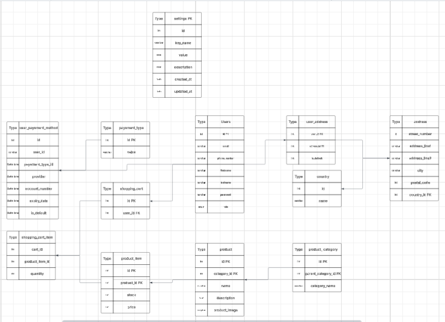

Ci-joint sont ajoutées les liens vers le diagramme de Gant, nos maquettes, le MCD et le BenchMark :
\_BenchMark : https://docs.google.com/document/d/1f_yAxzkWd23loF9hgbaxxotRgJkMyZcgB25MRtMygn8/edit?tab=t.0
\_Diagramme de Gant : https://www.notion.so/Diagramme-de-Gantt-2b1735d6b3e7800b9bdedf44f94812cf
\_Uses Cases : https://www.canva.com/design/DAG4qgfcHfI/2bDTxOEW0JyKF6_1iddBBA/edit
\_MCD : https://lucid.app/lucidchart/8ee0030a-7d15-4f18-89e8-10f7c1b99934/edit?page=0_0&invitationId=inv_acbb3f8e-1c49-43f2-adbe-24ab0c34d68c#
\_Maquette d'Ivan : https://www.figma.com/design/ViXReQwVlZANKNMoEMaIja/Candyland?node-id=3-10&t=t7e6Y0l3UKtjrIiT-0
\_Maquette d'Adam : https://www.figma.com/design/sqVk4b9fFsgriQDINpV7fJ/Untitled?node-id=0-1&p=f&t=53TRFgay4zrDcHoc-0
\_Maquette de Jawad : [text](../maquette_jawad.pdf)
\_Maquette de Mehdi : https://www.figma.com/design/3znPc4M2qI16JFLi2wlpgn/Untitled?node-id=0-1&p=f&t=7NAiUJJOXEby8OdU-0
\_Maquette de Pierre : https://www.figma.com/design/X6hep8PR9uqjfpzZRjSMg7/Untitled?node-id=0-1&p=f&t=97tTmBXqT3Lvb1Zs-0
\_Capture d'écran du MCD : 
